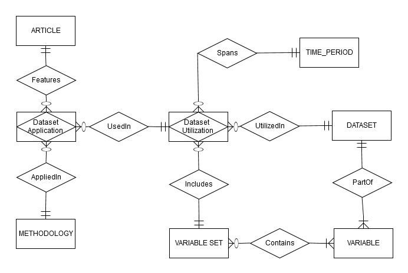

[DUOS Project](http://www.duosproject.org) tackles the problem of
extracting automatically and semi-automatically the relationships
between publications, datasets, and methodologies.  Our primary focus
is on research articles in economics.  From each article we extract
details about specific datasets used, including variables and time
periods as well as methodologies and techniques.

## History

In order to validate our conjecture about the difficulty of the
problem of extracting linkages between articles, data, and
methodologies and lay the groundwork for designing and developing a
comprehensive solution, we conducted a small pilot project working
with staff at the Center for the Advancement of Data and Research in
Economics (CADRE) at the Federal Reserve Bank of Kansas City.  The
goal of this project was to capture information on input datasets and
methodologies for a subset of academic papers that use the CPS
data. The results of this pilot project inspired the development of
DUOS.

## Motivation

Datasets play a pivotal role in economic research.  For example, the
	 Current Population Survey (CPS), a statistical survey
	 conducted by the United States Census Bureau, has been
	 administered since 1948 and has been used in thousands of
	 academic publications. While a search for "Current Population
	 Survey" on Google Scholar returns more than 100,000 [results](https://scholar.google.com/scholar?q="Current+Population+Survey"), a
	 simple mention of the dataset in an article is not sufficient
	 evidence of the dataset’s use within that research.  Many of
	 the articles are about the survey itself rather than about
	 its use as an input dataset to answer a research question.
	 Indeed, a substantial number of references simply mention why
	 the CPS was not used to answer a particular research
	 question. While a helpful general statistic, keyword search
	 results do not provide enough context to fully understand
	 dataset usage.  Furthermore, even for articles in the search
	 result which use the CPS data, the reference may appear just
	 in the body of the text, often without sufficient detail to
	 allow for meaningful identification. For example, the
	 specific details of what portions of the CPS data were used
	 in the study as well as the specific methodologies and
	 techniques utilized may be contained in the full text of the
	 article, can sometimes be found in the captions and legends
	 of graphs and figures, and could possibly appear in an
	 appendix or a separate data specific file.  Consequently,
	 finding all publications that use a particular portion of the
	 CPS data (e.g. all data from 1994 to 2014) is a complex and
	 time consuming task

## Use Cases of DUOS

* Comprehensive Literature Review
* Dataset Utilization
* Approaching New Datasets
* Generating New Research Applications   

We fully expect that DUOS will be used in conjunction with already
existing resources such as JSTOR, Web of Science by Thomson Reuters,
and Google Scholar.  Depending on the particular task, DUOS can be
used before, after, or alongside any of these research resources.

## Technical Details

### Partial ERD of the collected data 

The DUOS Team includes:

- [Svetlozar Nestorov](http://www.luc.edu/quinlan/faculty/svetlozarnestorov.shtml) (PI) 
- [Nenad Jukic](http://www.luc.edu/quinlan/faculty/nenadjuki.shtml) (co-PI)
- [Mary Malliaris](http://www.luc.edu/quinlan/faculty/marymalliaris.shtml) (co-PI)
- [Abhishek Sharma](http://www.luc.edu/quinlan/faculty/abhisheksharma.shtml) (co-PI)
- [San Cannon](https://www.kansascityfed.org/people/sandracannon) (advisor)

Student Research Assistants:

- Kelly Bryant
- Christopher Beemer
- Jordan Goodmanson
- John Dwyer

